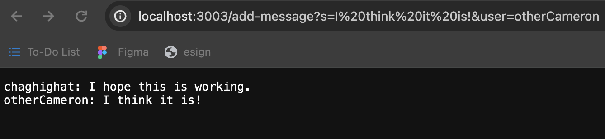
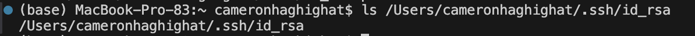
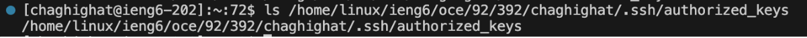
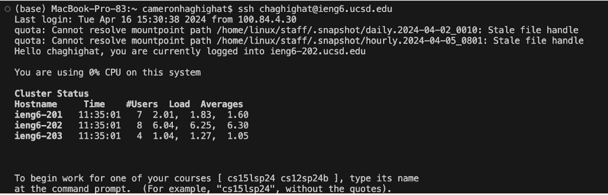

# **Lab Report 2**
---
## Part 1
### **`Chat Server` Code:**
```
import java.io.IOException;
import java.net.URI;
import java.util.List;
import java.util.ArrayList;

class Handler implements URLHandler {
    // The one bit of state on the server: a number that will be manipulated by
    // various requests.
    private List<String> comments = new ArrayList<>();

    public String handleRequest(URI url) {

        if (url.getPath().equals("/")) {
            return "Please provide arguments.";
        } else {
            if (url.getPath().contains("/add-message")) {
                String[] information = url.getQuery().split("&");
                String[] message = information[0].split("=");
                String[] user = information[1].split("=");
                if (user[0].equals("user") && message[0].equals("s")) {
                    String comment = String.format("%s: %s", user[1], message[1]);
                    comments.add(comment);
                    return String.join("\n", comments);
                }
            }
            return "404 Not Found!";
        }
    }
}

class ChatServer {
    public static void main(String[] args) throws IOException {
        if(args.length == 0){
            System.out.println("Missing port number! Try any number between 1024 to 49151");
            return;
        }

        int port = Integer.parseInt(args[0]);

        Server.start(port, new Handler());
    }
}
```
### **First `/add-message`:**



**Which methods in your code are called?**

In my code, the method handleRequest was called.<br /><br />

**What are the relevant arguments to those methods, and the values of any relevant fields of the class?**

The relevant argument to this method is the URL (http://localhost:3003/add-message?s=I%20think%20it%20is!&user=otherCameron) which includes the message and the username. The value of my ArrayList of strings called “comments” now has a value of: 

0 -> "chaghighat: I hope this is working."
1 -> "otherCameron: I think it is!"<br /><br />

**How do the values of any relevant fields of the class change from this specific request? If no values got changed, explain why.**

The value of the ArrayList “comments” changed from: 0 -> "chaghighat: I hope this is working."
to 1 -> "otherCameron: I think it is!"<br /><br />

### **Second `/add-message`:**


**Which methods in your code are called?**

In my code, the method handleRequest was called.<br /><br />

**What are the relevant arguments to those methods, and the values of any relevant fields of the class?**

The relevant argument to this method is the URL (http://localhost:3003/add-message?s=I%20am%20so%20happy.&user=chaghighat) which includes the message and the username. The value of my ArrayList of strings called “comments” now has a value of: 

0 -> "chaghighat: I hope this is working."
1 -> "otherCameron: I think it is!"
2 -> "chaghighat: I am so happy."<br /><br />

**How do the values of any relevant fields of the class change from this specific request? If no values got changed, explain why.**

The value of the ArrayList “comments” changed from: 

0 -> "chaghighat: I hope this is working."
1 -> "otherCameron: I think it is!"

To


0 -> "chaghighat: I hope this is working."
1 -> "otherCameron: I think it is!"
2 -> "chaghighat: I am so happy." <br /><br />


## Part 2

**On the command line of your computer, run ls with the absolute path to the private key for your SSH key for logging into ieng6.**
 <br /><br />

**On the command line of the ieng6 machine, run ls with the absolute path to the public key for your SSH key for logging into ieng6 (this is the one you copied to your account on ieng6 using ssh-copy-id, so it should be a path on ieng6's file system).**
 <br /><br />

**A terminal interaction where you log into your ieng6 account without being asked for a password.**
 <br /><br />


