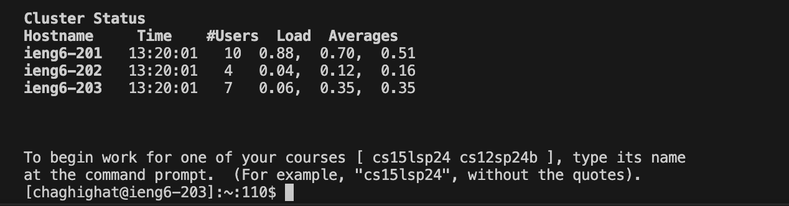
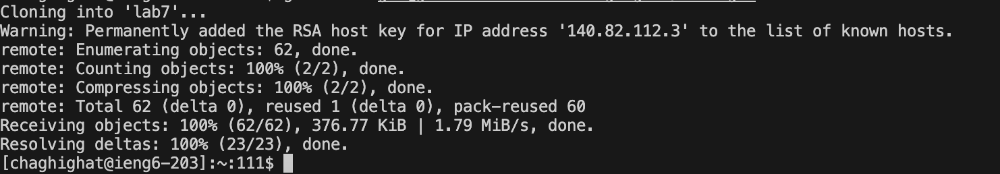
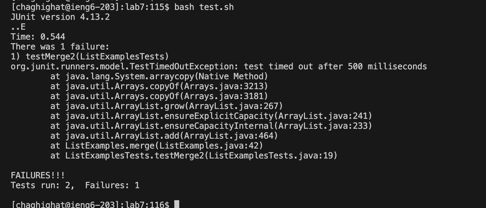
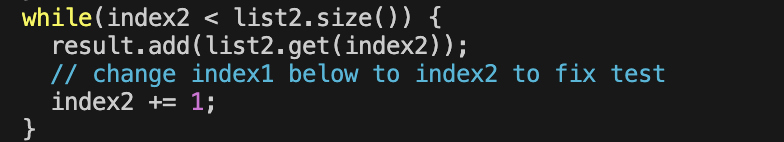
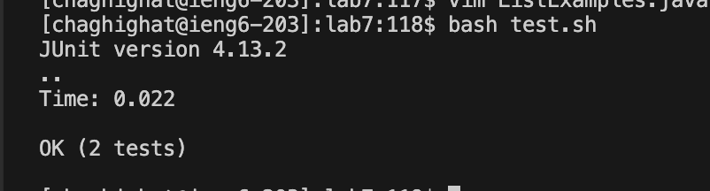
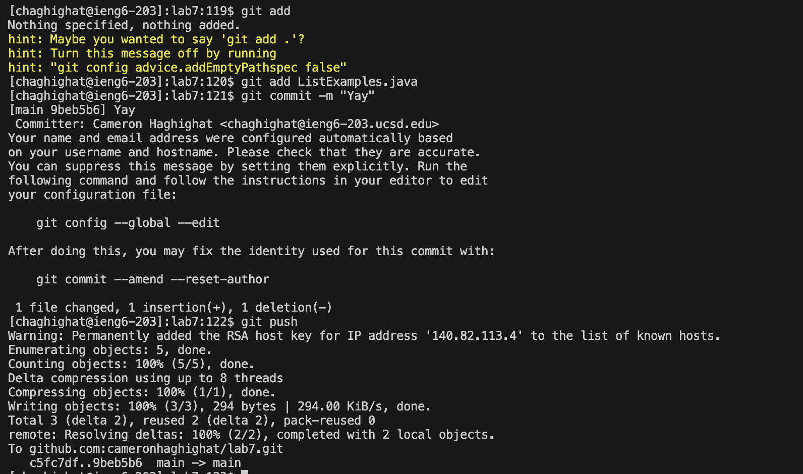

# Lab Report 4
---
## Step 4

### Screenshot

### Commands
`ssh<space>chaghighat@ieng6.ucsd.edu<enter>`

### Summary
The command permitted me to access my account on the ieng6 server.

## Step 5

### Screenshot

### Commands
`git<space>clone<space>git@github.com:cameronhaghighat/lab7.git<enter>`

### Summary
The command creates a clone of the forked repository and downloads all of the files within the repository.

## Step 6

### Screenshot

### Commands
`cd<space>lab7<enter>bash<space>test.sh<enter>`

### Summary
The commands change the working directory to the lab7 directory found in the repository and then run the bash script containing the tests.

## Step 7

### Screenshot

### Commands
`vim<space>ListExamples.java<enter>/44<enter>er2<ESC>:wq<enter>`

### Summary
The first command opens the file ListExamples.java in vim. Then `/44` finds the 44th line in the file, `e` places the cursor at the end of the word (index1), `r` tells vim we want to replace the character, and `2` replaces the character with 2 (1->2). Finally, `ESC` exits insert mode, and `:wq` saves and quits the editor.

## Step 8

### Screenshot

### Commands
`bash<space>test.sh<enter>`

### Summary
The command runs the bash script containing the tests.

## Step 9

### Screenshot

### Commands
git<space>add<space>ListExamples.java<enter>git<space>commit<space>-m<space>"Yay"<enter>git<space>push<enter>

### Summary
The command `git add ListExamples.java` stages the file ListExamples.java for the next commit. The command `git commit -m "Yay"` creates a new commit with the changes that have been staged and uses the -m flag to specify a commit message which in this case is "Yay". Finally `git push` pushes the changes from my repository to the remote repository, therefore, updating the remote repository.
